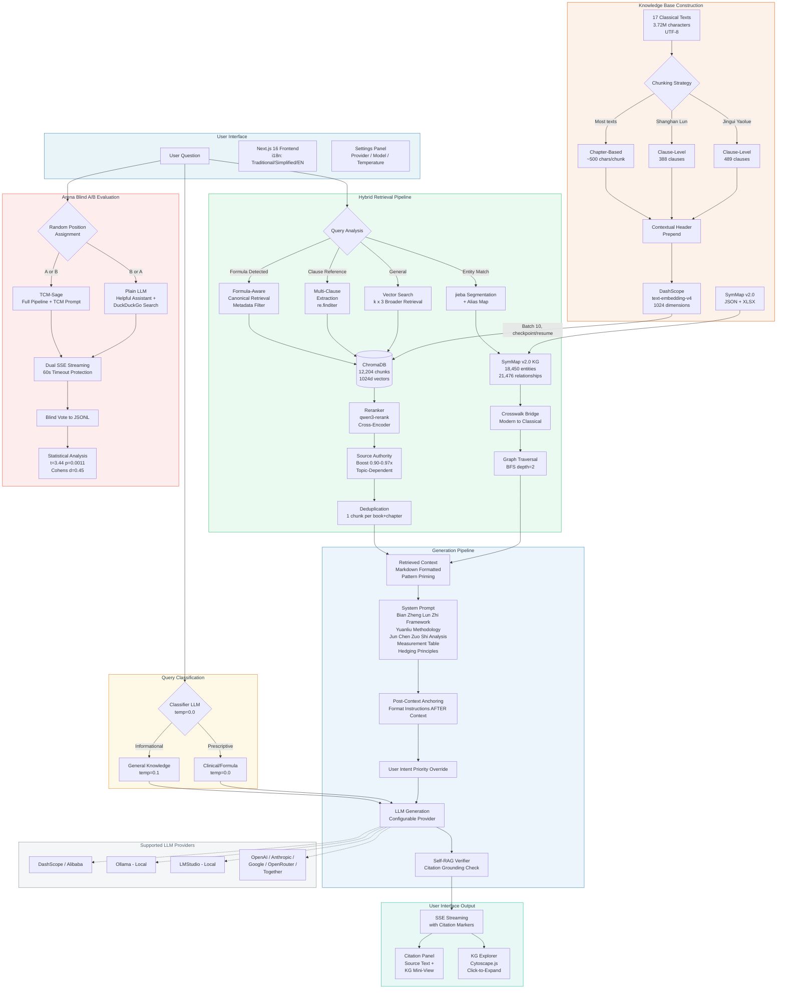

<!-- generated-by: gsd-doc-writer -->
# TCM-Sage System Architecture

TCM-Sage is an evidence-synthesis RAG (Retrieval-Augmented Generation) system for Traditional Chinese Medicine. It ingests 17 classical TCM texts (3.72M characters), indexes them in a vector store with domain-tuned embeddings, augments retrieval with the SymMap 2.0 knowledge graph (18,450 entities), and generates citation-grounded answers through a three-LLM architecture with query classification and self-verification. The system follows a **Modular RAG** paradigm — each stage (classification, retrieval, reranking, generation, verification) is an independent, configurable module.

## Component Diagram



## Data Flow

A typical query passes through the system in six stages:

1. **User Input** — The user submits a natural-language TCM question through the Next.js frontend (or CLI). The frontend sends a `POST /query` request to the FastAPI backend with optional per-request settings (provider, model, temperatures, retrieval parameters).

2. **Query Classification** — A lightweight Classifier LLM (e.g. `qwen3-0.6b` at temperature 0.0) reads the query and emits either `informational` (general knowledge, definitions) or `prescriptive` (diagnosis, treatment, formula advice). If classification is ambiguous, the system defaults to `prescriptive` for safety. This determines which temperature the generation LLM will use.

3. **Hybrid Retrieval** — Two independent retrieval paths run in parallel via `HybridRetriever` (`src/retriever.py`):
   - **Vector Search**: The query is embedded with DashScope `text-embedding-v4` (using a TCM-specific query prefix) and matched against 12,204+ chunks in ChromaDB. Results are reranked by `qwen3-rerank` (cross-encoder), then pass through source-authority boosting and deduplication (one chunk per book+chapter). Formula-aware and clause-reference queries use specialized retrieval paths (metadata filters, `re.finditer` extraction).
   - **Knowledge Graph Search**: `jieba` segmentation extracts entity mentions from the query. A colloquial-to-TCM alias map normalizes terms (e.g. 头疼→头痛). The crosswalk bridge (`src/crosswalk_bridge.py`) maps extracted terms to SymMap v2.0 node IDs. BFS traversal (default depth 2) retrieves related entities and relationships from the NetworkX directed graph.

4. **Context Assembly & Generation** — Vector chunks and graph facts are combined into a markdown-formatted context block (Pattern Priming — markdown headers and blockquotes cause the LLM to produce well-structured output). The context feeds into a system prompt implementing the 辨证论治 (Bian Zheng Lun Zhi) clinical reasoning framework, with 源流 (Yuanliu) methodology for multi-text citations, 君臣佐使 (Jun Chen Zuo Shi) formula analysis, historical measurement conversion tables, and hedging principles. The appropriate LLM instance (informational at temp 0.1 or prescriptive at temp 0.0) generates the answer via LangChain's LCEL chain.

5. **Self-RAG Verification** — A verifier LLM audits the generated answer against the retrieved context, checking faithfulness (no hallucinated claims) and completeness. The result is `SUPPORTED` or `UNSUPPORTED`, included in the response metadata.

6. **Streaming Output** — The response streams to the frontend via Server-Sent Events (SSE). The final `metadata` event carries structured citations (`TextCitation` and `GraphCitation` typed dicts), verification status, and query classification. The frontend renders the answer with inline citation markers `[1]`, `[2]`, etc., a citation panel for full source text viewing, and a KG mini-viewer showing entity neighborhoods.

## Key Abstractions

| Abstraction | File | Description |
|---|---|---|
| `HybridRetriever` | `src/retriever.py` | Ensemble retriever combining ChromaDB vector search with NetworkX graph traversal. Exposes `vector_search()`, `graph_search()`, and `hybrid_search()` methods. |
| `TCMKnowledgeGraph` | `src/graph_builder.py` | NetworkX DiGraph wrapper for SymMap v2.0. Supports 13 entity types (Symptom, Herb, Formula, Disease, Ingredient, Target, Syndrome, etc.) and 14 relationship types. Uses jieba + colloquial alias map for entity matching. |
| `DashScopeEmbeddings` | `src/embeddings.py` | LangChain `Embeddings` implementation wrapping DashScope `text-embedding-v4` (1024d). Applies TCM domain-specific prefixes: ingestion prefix for documents, query prefix for search queries. Batch limit of 10. |
| `rerank_documents()` | `src/embeddings.py` | DashScope `qwen3-rerank` cross-encoder reranker. Called inside `hybrid_search()` to re-score vector results by query relevance. |
| `resolve_query_to_symmap_ids()` | `src/crosswalk_bridge.py` | Query-time bridge mapping RAG terms to SymMap node IDs via an approved CSV crosswalk (`data/graph/crosswalk/seed_crosswalk_approved.csv`). |
| `SelfCritiqueVerifier` | `src/verifier.py` | Pydantic-structured Self-RAG verification. Produces `VerificationResult` with `is_faithful`, `is_complete`, `critique`, and `confidence_score` fields. |
| `create_llm()` | `src/main.py` | LLM factory supporting 8 providers (alibaba, openai, google, anthropic, openrouter, together, ollama, lmstudio) with configurable temperature and streaming. |
| `get_query_severity()` | `src/main.py` | Query classifier using a lightweight LLM to emit `informational` or `prescriptive`. Defaults to `prescriptive` on ambiguous output. |
| `PipelineConfig` | `src/ui_backend.py` | Frozen dataclass consolidating all runtime config (provider, models, temperatures, retrieval settings, graph config) resolved from environment variables and per-request overrides. |
| `run_query_stream()` | `src/ui_backend.py` | Core streaming pipeline: classify → retrieve → generate → verify citation bounds and answer support → yield SSE chunks + metadata event. Used by both the API server and arena. |
| `get_chunk_context()` / `get_book_text()` | `src/source_context.py` | Source drill-down helpers for reconstructing full chapter context and loading raw book text. |
| `generate_arena_sse_stream()` | `src/arena_stream.py` | Dual-panel Arena SSE scheduler with random A/B assignment and timeout handling. |
| `compute_arena_stats()` | `src/arena_stats.py` | Arena JSONL vote aggregation, paired t-test, Cohen's d, and per-query result breakdown. |
| `SentenceAwareChineseTextSplitter` | `src/ingest.py` | Text splitter respecting Chinese sentence boundaries (。；！？). Produces ~500 char chunks with configurable overlap. |
| `TextCitation` / `GraphCitation` | `src/citation_types.py` | TypedDict schemas for structured citation metadata passed to the frontend in the SSE metadata event. |

## Directory Structure Rationale

```
TCM-Sage/
├── src/                    # All production Python — RAG core, API, KG, arena
│   ├── main.py             # CLI entry, LLM factory, prompts, classification, verification
│   ├── api.py              # Thin FastAPI route layer (SSE, CORS, health, source, arena)
│   ├── ui_backend.py       # Cached resources, PipelineConfig, run_query_stream
│   ├── source_context.py   # Source drill-down and raw book text lookup
│   ├── arena_stream.py     # Arena dual-panel SSE scheduler
│   ├── arena_stats.py      # Arena vote statistics and significance testing
│   ├── retriever.py        # HybridRetriever — vector + graph ensemble with reranking
│   ├── graph_builder.py    # TCMKnowledgeGraph — NetworkX loader, jieba entity matching, BFS traversal
│   ├── crosswalk_bridge.py # RAG↔SymMap entity resolution via approved CSV crosswalk
│   ├── embeddings.py       # DashScope text-embedding-v4 + qwen3-rerank wrapper
│   ├── citation_types.py   # TextCitation, GraphCitation TypedDicts
│   ├── verifier.py         # SelfCritiqueVerifier (Self-RAG faithfulness audit)
│   ├── config.py           # Centralized paths and defaults (PROJECT_ROOT, VECTORSTORE_DIR, etc.)
│   ├── ingest.py           # Offline ingestion pipeline (text → chunks → embeddings → ChromaDB)
│   ├── arena.py            # Arena blind A/B: RAG vs raw LLM, model tiers, vote JSONL storage
│   └── test_*.py           # Colocated test scripts (run directly with venv python, no pytest)
│
├── web/                    # Next.js 16 + React 19 frontend
│   ├── app/                # App Router pages
│   │   ├── page.tsx        # Main chat interface
│   │   ├── arena/          # Arena blind A/B evaluation + stats page
│   │   ├── kg/[entityId]/  # KG explorer (Cytoscape.js entity subgraph viewer)
│   │   ├── source/         # Source text drill-down pages
│   │   └── api/backend/    # Next.js API route proxying to FastAPI
│   ├── components/         # UI building blocks (ChatArea, CitationPanel, KGViewer, SettingsModal, etc.)
│   ├── hooks/              # State management (useChat, useArena, useSettings, useHistory, useKeepAlive)
│   ├── lib/                # API client, markdown renderer, citation utilities, shared types
│   └── i18n/               # Internationalization (zh.json, en.json, context.tsx)
│
├── data/
│   ├── source/             # 17 classical TCM .txt files (UTF-8 plain text)
│   ├── processed/          # chunks.json + ingest_checkpoint.json (generated by ingest.py)
│   ├── graph/symmap/       # SymMap v2.0 knowledge graph (symmap_entities.json + raw xlsx)
│   ├── graph/crosswalk/    # RAG↔SymMap entity bridge (approved/pending CSV)
│   └── feedback/           # Arena vote records (arena_votes.jsonl)
│
├── vectorstore/            # ChromaDB persistence directory (1024-dim vectors, generated)
├── presentation/           # Slidev FYP presentation (slides.md + public/figures/)
└── docs/                   # Project documentation, FYP report, research notes
```

**Why this layout:**

- **`src/` is flat, not a Python package** — Files use `sys.path` bootstrap imports rather than `__init__.py`. This keeps the project simple and avoids packaging overhead for a single-deployment research tool. All production Python lives in one directory for discoverability.
- **`web/` is a standalone Next.js app** — The frontend is fully decoupled from the Python backend, communicating only via HTTP (SSE for streaming, REST for config/arena). It proxies backend requests through `web/app/api/backend/` to handle CORS in development.
- **`data/` separates source from generated** — Raw `.txt` corpus files in `data/source/` are version-controlled. Generated artifacts (`data/processed/`, `vectorstore/`) are `.gitignore`d and rebuilt by running `ingest.py`.
- **Knowledge graph data is external** — SymMap v2.0 data lives in `data/graph/symmap/` as JSON, loaded at startup by `graph_builder.py`. The crosswalk bridge (`data/graph/crosswalk/`) maps between classical text terminology and SymMap's modern biomedical vocabulary.
- **Tests are colocated scripts** — No pytest framework. Test files (`src/test_*.py`, `scripts/test_*.py`, `scripts/verify_*.py`) run directly with `venv\Scripts\python.exe` and are self-contained verification scripts.

## Design Decisions

### Glass-Box Design Philosophy (Self-RAG)

The system is designed as a **glass box** — every answer is transparent and verifiable, not a black-box LLM response. The architecture is inspired by **Self-RAG** (Asai et al., 2024):

1. **Adaptive Retrieval:** The system first determines if a query requires retrieval or is conversational.
2. **Generate & Critique:** The LLM generates an answer from retrieved text, then a separate Verifier LLM critiques it for:
   - **Support:** Is the answer supported by the source text?
   - **Relevance:** Is the answer relevant to the question?
3. **Controllable Inference:** A lightweight Classifier LLM routes queries by clinical severity:
   - **Informational** (low severity): Higher temperature for nuanced, descriptive answers.
   - **Prescriptive** (high severity): Temperature 0.0 for maximum adherence to source text.

This design ensures practitioners can **verify AI-generated advice against the original classical texts** — the core differentiator from existing TCM LLMs.

### Three-LLM Architecture

The system instantiates three separate LLM instances per session:

| LLM | Role | Typical Model | Temperature |
|---|---|---|---|
| **Classifier** | Query severity classification | `qwen3-0.6b` (lightweight) | 0.0 |
| **Informational** | General knowledge answers | `qwen-plus` (main model) | 0.1 (configurable) |
| **Prescriptive** | Clinical/formula advice | `qwen-plus` (main model) | 0.0 (strict) |

A separate **Verifier** LLM (also configurable) handles the Self-RAG faithfulness audit. The classifier and verifier can optionally follow the main provider/model selection (`classifier_follow_main`, `verifier_follow_main` flags).

### Hybrid Retrieval: Ensemble Context Aggregation

Rather than fusing vector and graph results into a single ranked list, the system uses **Ensemble Context Aggregation**: both sources are queried independently and their results are concatenated with source-type metadata. The LLM prompt formats them as distinct context sections (text passages vs. knowledge graph facts), allowing the model to reason about each evidence type appropriately.

### Domain-Specific Embedding Prefixes

DashScope `text-embedding-v4` supports instruction-prefixed embeddings. The system uses two TCM-specific prefixes:

- **Ingestion**: `"为这段中医古籍文本生成语义表示用于检索："` — optimizes document embeddings for retrieval from classical TCM texts.
- **Query**: `"为这个中医临床问题生成语义表示以检索相关古籍段落："` — aligns user questions with the document embedding space.

### Pattern Priming

Retrieved context is formatted as markdown (with `###` headers and `>` blockquotes) rather than plain text. This exploits the LLM's tendency to mirror input formatting — producing well-structured, headed, listed output rather than flat prose. Empirically measured as producing 3.7× longer, better-structured answers.

### Crosswalk Bridge

SymMap v2.0 uses modern biomedical vocabulary while the classical texts use historical TCM terminology. The crosswalk bridge (`src/crosswalk_bridge.py`) maintains an approved CSV mapping (`data/graph/crosswalk/seed_crosswalk_approved.csv`) that translates between these vocabularies at query time, enabling the KG search to find relevant entities even when the user's query uses classical terms.

### Arena Evaluation

The arena system (`src/arena.py`, `src/arena_stream.py`, `src/arena_stats.py`, `web/app/arena/`) implements blind A/B comparison: the same query is sent to both the full RAG pipeline (with TCM system prompt) and a plain LLM (with a generic "helpful assistant" prompt + DuckDuckGo search through the `ddgs` package). Responses are randomly assigned to positions A/B. Users vote without knowing which is which. Results are stored in `arena_votes.jsonl` and analyzed with paired t-test, Cohen's d effect size, and win-rate charts on the statistics page (`web/app/arena/stats/`).

## Supported LLM Providers

The `create_llm()` factory in `src/main.py` supports 8 providers, all accessed through LangChain's chat model abstractions:

| Provider | LangChain Class | Auth Key |
|---|---|---|
| Alibaba / DashScope | `ChatOpenAI` (OpenAI-compatible) | `DASHSCOPE_API_KEY` |
| OpenAI | `ChatOpenAI` | `OPENAI_API_KEY` |
| Google | `ChatGoogleGenerativeAI` | `GOOGLE_API_KEY` |
| Anthropic | `ChatAnthropic` | `ANTHROPIC_API_KEY` |
| OpenRouter | `OpenRouter` | `OPENROUTER_API_KEY` |
| Together | `Together` | `TOGETHER_API_KEY` |
| Ollama (local) | `ChatOpenAI` (OpenAI-compatible) | N/A (local) |
| LM Studio (local) | `ChatOpenAI` (OpenAI-compatible) | N/A (local) |

## Frontend Architecture

The Next.js 16 frontend uses the App Router with React 19 and communicates with the FastAPI backend via:

- **SSE streaming** (`POST /query`) for real-time answer generation with inline citation markers.
- **REST endpoints** (`GET /config`, `GET /health`, source context endpoints) for configuration and drill-down data.
- **Arena endpoints** (`POST /arena/query`, `POST /arena/vote`, `GET /arena/votes`) for blind evaluation.

Key frontend modules:

| Module | Path | Purpose |
|---|---|---|
| Chat hook | `web/hooks/useChat.ts` | SSE stream consumption, message state, citation extraction |
| API client | `web/lib/api.ts` | Backend HTTP client with proxy routing |
| Citation Panel | `web/components/CitationPanel.tsx` | Source text display with paragraph context reconstruction |
| KG Viewer | `web/components/KGViewer.tsx` | Entity subgraph visualization (Cytoscape.js) |
| Arena hook | `web/hooks/useArena.ts` | Dual-stream management, vote submission, session tracking |
| Settings | `web/hooks/useSettings.ts` + `web/components/SettingsModal.tsx` | Provider/model/temperature configuration |
| Markdown | `web/lib/markdown.ts` | Shared markdown renderer with citation button injection and table support |
| i18n | `web/i18n/` | Traditional Chinese, Simplified Chinese, and English UI localization |
